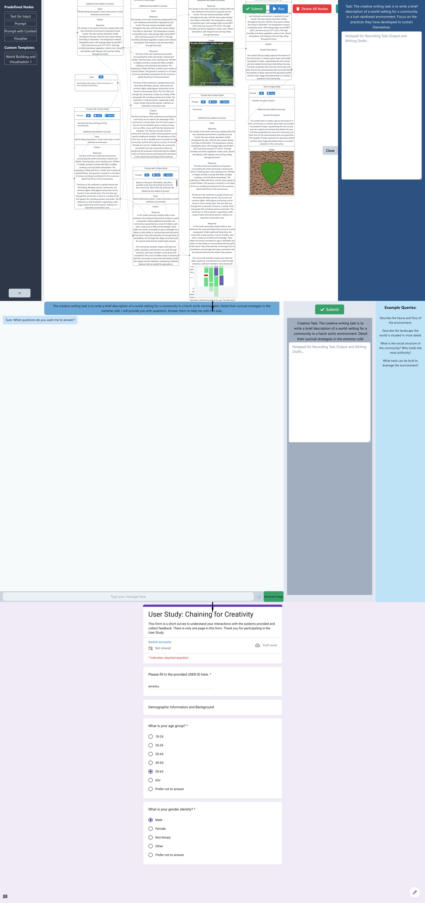

# Chaining Generative AI Models for Ideation in Creative Writing - Honours Study
A User Study for a Graphical Node-based interface for LLMs used to explore ideation and creativity for writers.
Consists of a graph based system, a conversational system and a suvrey. 
## The Study Process

