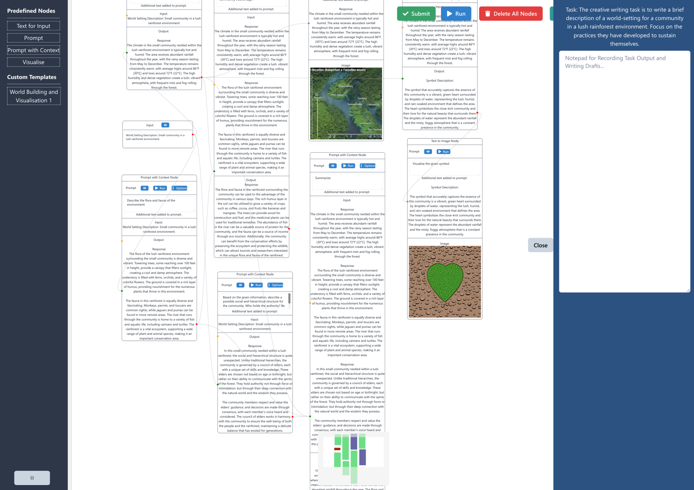
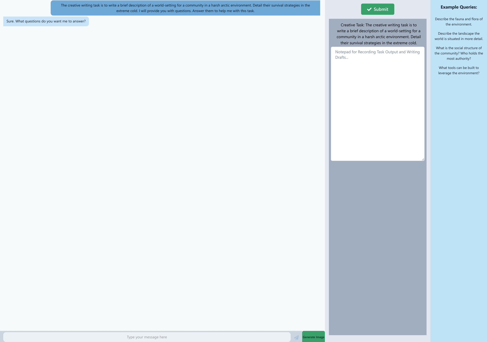

# Chaining Generative AI Models for Ideation in Creative Writing
We explore a Graphical Node-based interface for LLMs used to explore ideation and creativity for writers.
Users chain together generative AI models organised into nodes for creative tasks. This system was designed to overcome the structural constraints inherent in traditional chat-based, one-on-one interactions.

## Repository structure
The repository is divided into a React.js frontend and a Flask backend. Both can be set up by following the instructions in the README.md(s) of the respective folders. The .env file can be used to set the location of the backend where API calls are made to get output from LLMs. The front end uses ReactFlow to provide node-based functionality and to develop a baseline chat-based interface. Zustand is used for state management. 

The backend uses OpenHermes-2.5-Mistral-7B and Stable Diffusion 2.1 via the transformers and diffusers libraries, respectively. We run the backend models on an NVIDIA RTX A6000 50GB GPU.

## The Graph-based creative writing interface

## The Chat-based creative writing interface

